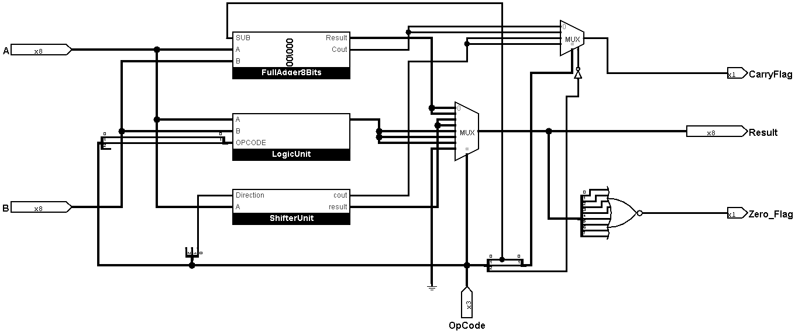
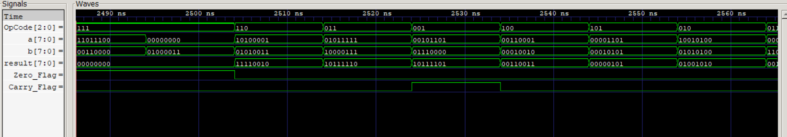
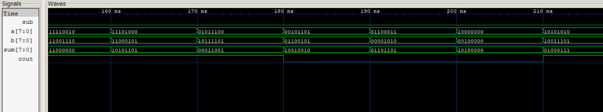
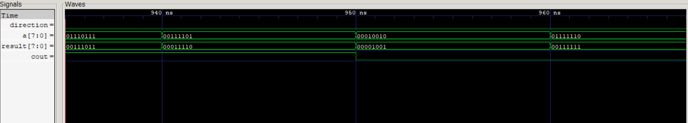
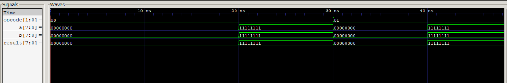

# 8-Bit Arithmetic Logic Unit (ALU)
**Author:** Ido Shalit

## Overview
This project features a complete hierarchical design and verification of an 8-bit ALU. The design process began with logic gate architecture planning and progressed to RTL implementation and extensive functional verification.

## 1. Logic Design (Architecture)
The system was initially architected using Logisim to ensure correct data paths and a modular hierarchy. Below is the top-level design, built from smaller sub-components (Full Adders, Logic Units, Shifters, etc.).

*(Note: The project includes detailed structural designs for `FULL_ADDER_8BITS`, `LEFT_SHIFTER`, `LOGIC_UNIT`, and more, which can be found in the LOGISIM_IMAGES directory).*

## 2. RTL Implementation
The hardware was written in **SystemVerilog**, utilizing both structural and behavioral modeling. 
The modules implement the following hierarchy:
* **Arithmetic Unit** (built with 1-bit and 8-bit Full Adders)
* **Logic Unit** (bitwise AND, OR, XOR)
* **Shifter Unit** (Left and Right shifting)
* **Top-Level ALU** (Integrating all units with an OpCode selector)

## 3. Verification & Simulation
To ensure absolute hardware robustness, verification went beyond basic functional checks. I developed a **self-checking SystemVerilog testbench** designed for automated testing, running a loop of 500 randomized test vectors to validate operations across all modules. 

However, since randomized testing can easily miss critical boundary conditions, I deliberately implemented **manual, directed edge-case tests**. These targeted scenarios force extreme hardware states—such as maximum value overflows and zero-result evaluations—to guarantee that the Carry and Zero status flags behave perfectly under pressure.

Extensive unit testing was performed using **Icarus Verilog** and **GTKWave**. Each module was tested individually to ensure correct carry propagation, logic operations, and flag generation before the top-level integration.

### ALU Top-Level Simulation

### Arithmetic Unit Verification

### Shifter Unit Verification

### Logic Unit Verification

